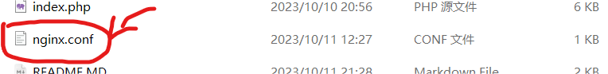
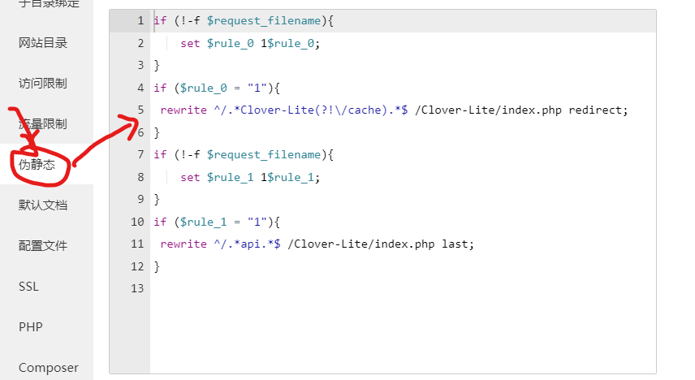
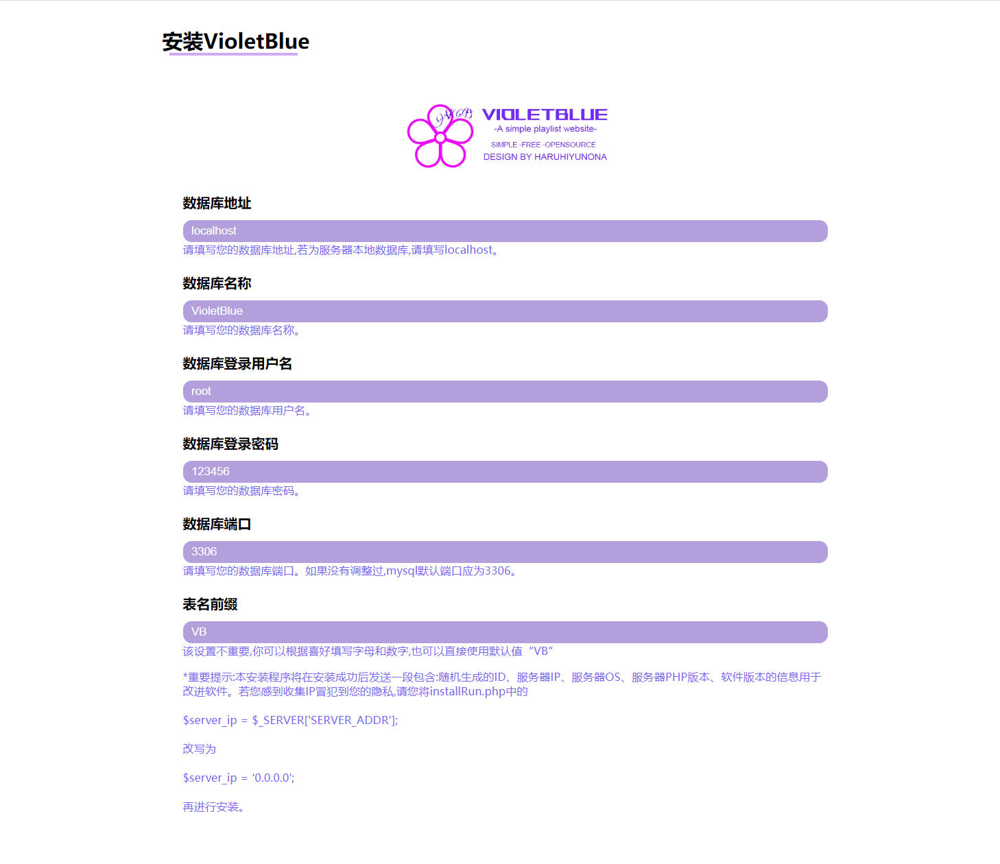
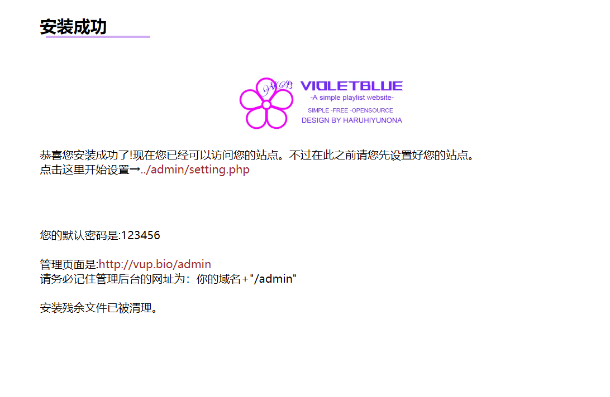

# VioletBlue 歌单站

###### choose your language

## 一、安装前准备

#### 1.PHP服务器环境

	若您使用的PHP服务器为Apache，您直接将本网站源代码（或release）放置到网站根目录即可。

   若您使用的PHP服务器为NGINX，请您将本网站源代码（或release）放置到网站根目录后复制nginx.conf的内容到网站伪静态配置文件。

if↓

                                                                                                                     ↓

#### 2.绑定您的域名并创建数据库

#### 3.访问您的域名

## 二、安装

#### 1.配置正确情况下，访问您的域名将会直接显示安装页面。

根据网页提示安装即可。

记得点击管理页面去设置网站哦!

## 三、接口说明

#### 1.本站仅一个数据接口，即

> http://域名/api/请求字段

具体作用可看源码Clover-Lite/lib/class/Handler.class.php

祝您使用愉快!

本项目讨论群（QQ）：606917884
