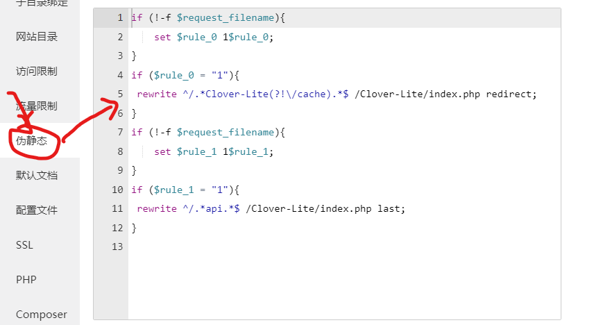
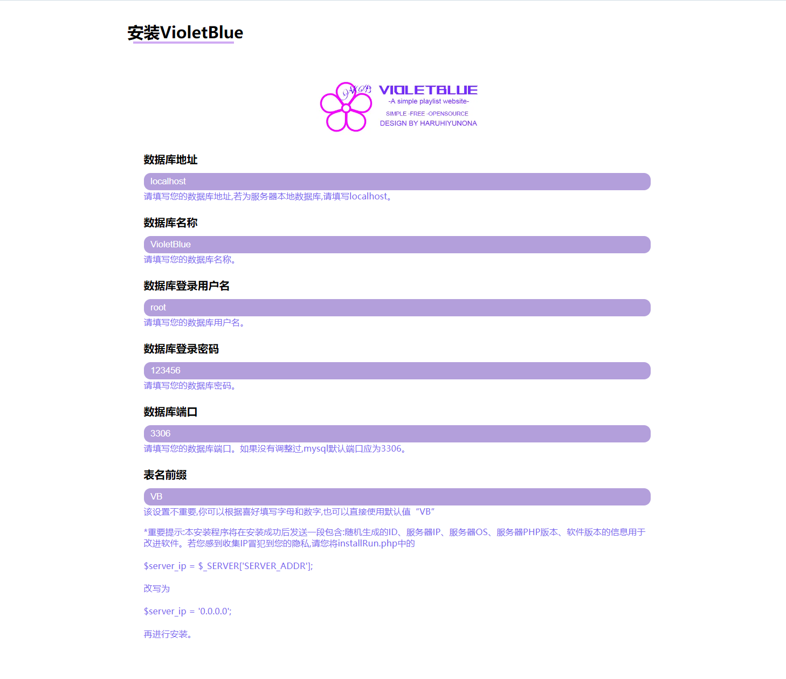
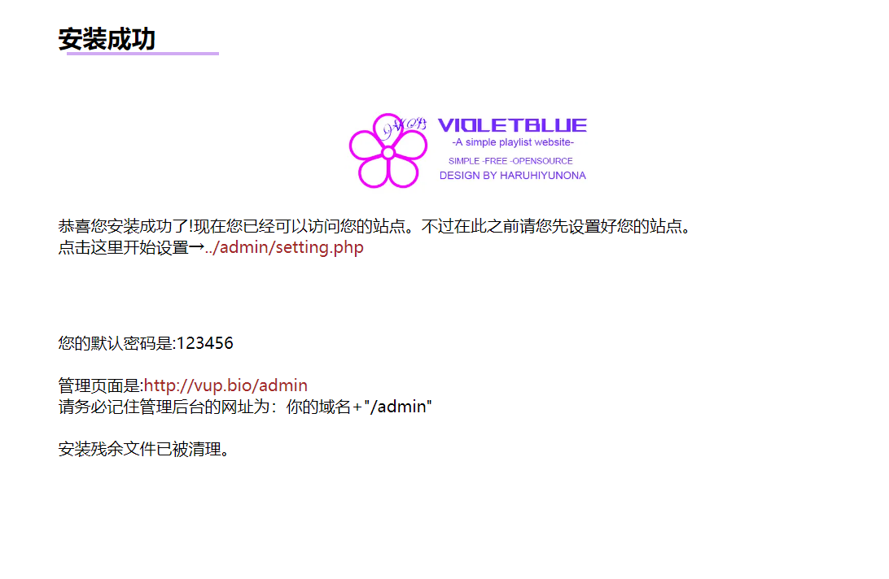

# VioletBlue Playlist Website

    

###### choose your language

## FIRST> Preparation

#### 1.PHP Server environment

If you are using Apache PHP server , you can directly place the source code (or release) of this website in the root directory of the website.

Or using NGINX PHP server,  please place the source code (or release) of this website in the root directory of the website and copy the content of "nginx. conf" to the pseudo static configuration file of the website.

if→

​                                                                                                                     ↓

#### 2.Bind your domain and create a database

#### 3.Access your domain

## Second> Install

#### 1.If the configuration is correct, accessing your domain will directly display the installation page.

Install according to the webpage prompts.

Remember to click on the management page to set up the website!

## Third> Interface Description

#### 1.This site only has one data interface

> http://domain/api/request

The specific function can be found in the source code Clover-Lite/lib/class/Handler.class.php

Have fun!

GROUP（QQ）：606917884
